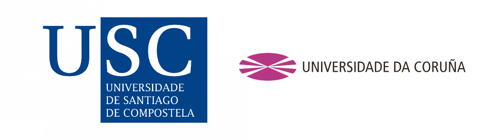
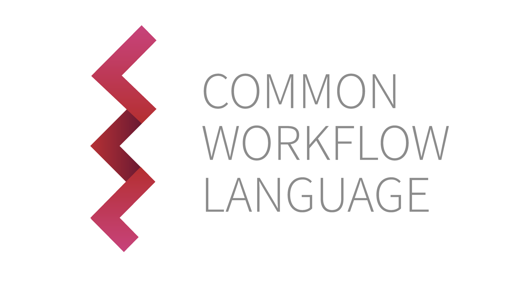

# CWL & MPI

This repository contains [Common Workflow Language (CWL)](https://www.commonwl.org/)
workflows integrating the [Message Passing Interface (MPI)](https://www.mpi-forum.org/).

The workflows were developed as part of the master's thesis:

**“CWL Workflows with MPI in Bare-Metal, Containers, Cloud, and HPC Environments”**  
by [Bruno de Paula Kinoshita](https://orcid.org/0000-0001-8250-4074), within the Joint Master in High Performance
Computing offered by the [University of Santiago de Compostela](https://www.usc.gal/) and
the [University of A Coruña](https://udc.es/).

The thesis was supervised by [Michael R. Crusoe](https://orcid.org/0000-0002-2961-9670)
and [Prof. Pablo Quesada](https://orcid.org/0000-0002-3790-8819).

  

## Contents

This repository includes:

- CWL workflows integrating MPI execution models
- CWL conformance test results across multiple CWL runners
- Execution logs from HPC and cloud environments
- Supporting scripts for generating thesis figures and LaTeX tables

The results cover executions on:

- Hetzner Cloud (OpenMPI 5)
- Framework Laptop AMD 13 (MPICH 4)
- CSC LUMI (Cray MPICH 8.1.32)
- BSC MareNostrum 5 (Intel MPI 2021.10.0)

---

## CWL Conformance Tests

CWL conformance testing was performed using:

- [cwltool 3.2.20260413085819](https://pypi.org/project/cwltool/3.2.20260413085819/)
- [Toil 9.4.1](https://pypi.org/project/toil/9.4.1/)
- [StreamFlow 0.2.0rc2](https://pypi.org/project/streamflow/0.2.0rc2/)

### Test environments

- [CESGA FinisTerrae III](https://cesga-docs.gitlab.io/ft3-user-guide/index.html) 🇪🇸
- [CSC LUMI](https://www.lumi.csc.fi/public/) 🇫🇮
- [BSC MareNostrum 5](https://bsc.es/marenostrum/marenostrum-5) 🇪🇸

Reports and results: [CWL Conformance Tests](./cwl-conformance-tests/README.md)

---

## Workflows

The repository contains example workflows used for evaluation
of MPI execution in CWL.

Container-based experiments used images from:
https://hub.docker.com/u/mfisherman  
https://github.com/mfisherman/docker

---

### Simple MPI Workflow

The `sr.c` program from MPICH is used to validate MPI execution in CWL.
It prints MPI rank information and serves as a minimal correctness test.

Execution variants:

- [cwltool](./workflows/mpich-sr/README-cwltool.md)
- [Toil](./workflows/mpich-sr/README-toil.md)
- [StreamFlow](./workflows/mpich-sr/README-streamflow.md)

Full workflow description: [Simple MPI Workflow](./workflows/mpich-sr/README.md)

---

### FALL3D Workflow

The FALL3D workflow originates from the GEO3BCN-CSIC project:

https://gitlab.geo3bcn.csic.es/fall3d/getit-workflows

This repository includes a modified version that:

- supports execution without container dependencies
- accepts input files and binaries via parameters
- introduces an alternative execution model using `MPIRequirement`

The modified version is available at:
https://github.com/kinow/getit-workflows/pull/1

Full workflow description: [FALL3D Workflow](./workflows/fall3d/README.md)

---

## Supporting scripts

Python scripts in this repository are used to generate LaTeX tables
and figures for the thesis. They process:

- CWL conformance test results
- workflow execution logs
- output artifacts produced during experiments

A `requirements.txt` file is provided where dependencies are required.

---

## Tools and platforms used

The following tools and platforms were used during the thesis:

- CWL
  runners: [cwltool](https://cwltool.readthedocs.io/en/latest/), [Toil](https://toil.readthedocs.io/en/latest/), [StreamFlow](https://streamflow.di.unito.it/)
- MPI implementations: MPICH, OpenMPI, Cray MPICH, Intel MPI
- HPC systems: LUMI, MareNostrum 5, FinisTerrae III
- Development tools: Git, Python, Bash, LaTeX, SSH, FileZilla
- IDE: PyCharm
- Bibliography: Zotero
- Writing: Overleaf

---

## Related repositories

- https://github.com/kinow/msc-project-management/ — thesis planning and research notes
- https://github.com/kinow/getit-workflows/ — fork of FALL3D workflows with MPIRequirement support

---

  
  

---

## License

Data in this repository is licensed under [CC-BY-4.0](https://creativecommons.org/licenses/by/4.0/).

Software components retain their original licenses
(e.g., MPICH `sr.c` test program is distributed under the MPICH license).
