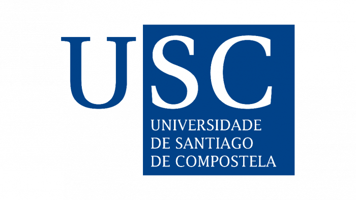

# CWL MPI

This repository contains [Common Workflow Language (CWL)](https://www.commonwl.org/)
workflows that use [Message Passing Interface (MPI)](https://www.mpi-forum.org/).
They were developed for testing and demonstration purposes as part of the master's
thesis by [Bruno de Paula Kinoshita](https://orcid.org/0000-0001-8250-4074), completed within the
[Joint Master in High Performance Computing](https://www.usc.gal/en/studies/masters/engineering-and-architecture/master-high-performance-computing-online) offered by the
[Universities of Santiago de Compostela](https://www.usc.gal/) and [A Coruña](https://udc.es/).
The thesis, “CWL Workflows with MPI in Bare-Metal, Containers, Cloud, and HPC Environments”,
explores the use of MPI-enabled CWL workflows across a range of computing platforms
(HPC, cloud, bare-metal) and the use of containers to run the workflows. The thesis
was mentored by [Michael R. Crusoe](https://orcid.org/0000-0002-2961-9670),
and [Prof. Pablo Quesada](https://orcid.org/0000-0002-3790-8819).

## Contents

There are also results of the CWL Conformance Tests executed on HPC systems,
and the logs from the executions of the CWL+MPI workflows performed on Hetzner
cloud (OpenMPI 5), Framework AMD 13 laptop (MPICH 4), LUMI CSC (Cray MPICH 8.1.32),
and BSC MareNostrum 5 (Intel MPI 2021.10.0).

## CWL Conformance Tests

The CWL Conformance Tests were executed using:

- [cwltool 3.2.20260413085819](https://pypi.org/project/cwltool/3.2.20260413085819/)
- [Toil 9.4.1](https://pypi.org/project/toil/9.4.1/)
- [StreamFlow 0.2.0rc2](https://pypi.org/project/streamflow/0.2.0rc2/)

The tests were used to evaluate the compatibility of these CWL runners with
HPC platforms. The tests were executed on the following HPC systems:

- [CESGA FinisTerrae III](https://cesga-docs.gitlab.io/ft3-user-guide/index.html) 🇪🇸
- [CSC LUMI](https://www.lumi.csc.fi/public/) 🇫🇮
- [BSC MareNostrum 5](https://bsc.es/marenostrum/marenostrum-5) 🇪🇸

Results and reports for CWL conformance testing:
[Report](./cwl-conformance-tests/README.md)

## Workflows

Example workflows used throughout the tests and evaluations.

A great part of the work with containers used images from
<https://hub.docker.com/u/mfisherman>, hosted at <https://github.com/mfisherman/docker>.
We are grateful for their work.

The workflows were executed on the following platforms:

- [CSC LUMI](https://www.lumi.csc.fi/public/) 🇫🇮
- [BSC MareNostrum 5](https://bsc.es/marenostrum/marenostrum-5) 🇪🇸
- [Hetzner Cloud](https://www.hetzner.com/) 🇩🇪
- A laptop [Framework AMD 13](https://frame.work/)

### Simple MPI Workflow

`sr.c`: is a test program from MPICH that prints information about MPI ranks.
It is used to verify that MPI applications can be launched correctly through
CWL on HPC systems.

* [cwltool](./workflows/mpich-sr/README-cwltool.md)
* [Toil](./workflows/mpich-sr/README-toil.md)
* [StreamFlow](./workflows/mpich-sr/README-streamflow.md)

For a description of the workflow and its files, see the main report:
[Workflow Report](./workflows/mpich-sr/README.md)

### FALL3D Workflow

The original FALL3D Workflow is developed by GEO3BNC-CSIC, and it is hosted
at <https://gitlab.geo3bcn.csic.es/fall3d/getit-workflows>.

It was modified to support running without container support and to receive the input
files and model binary via parameters. A new version was created to run with
the `MPIRequirement`, <https://github.com/kinow/getit-workflows/pull/1>.

For a description of the workflow and its files, see the main report:
[Workflow Report](./workflows/fall3d/README.md)

## LaTeX scripts

Most of the Python scripts in this repository are used to generate the LaTeX reports
for the CWL Conformance Tests. These scripts were made to read the CWL Conformance Test
results, or the Workflow results (output logs, files produced by `Makefile` targets)
and to generate the LaTeX tables and figures used in the thesis.

When dependencies are needed to run a `requirements.txt` file is provided.

## Tools

The following software was used during the thesis:

- [Overleaf](https://www.overleaf.com/), for writing the thesis
- Git, Python, LaTeX, SSH, FileZilla, Bash Shell, and Linux
- [PyCharm IDE](https://www.jetbrains.com/pycharm/) for most of the development
- CWL Runners ([cwltool](https://cwltool.readthedocs.io/en/latest/),
  [StreamFlow](https://streamflow.di.unito.it/), [Toil](https://toil.readthedocs.io/en/latest/))
- MPICH, OpenMPI, Cray MPICH, Intel MPI

## Other links

- <https://github.com/kinow/msc-project-management/>, umbrella repository for the thesis,
  including paper reading, general discussions, and initial analysis of the thesis topic.
- <https://github.com/kinow/getit-workflows/>, the fork of the original FALL3D What-If
  Scenarios workflow by GEO3BCN. It contains a single pull request with the modifications
  for the assessment of the workflow with the `MPIRequirement` and/no containers.
- <https://www.usc.gal/gl>, University of Santiago de Compostela.

## License

The data in this repository is licensed under CC-BY-4.0. Software and source code used
maintain their licence (i.e., the `sr.c` test code from MPICH, is licensed under the MPICH
licence).
