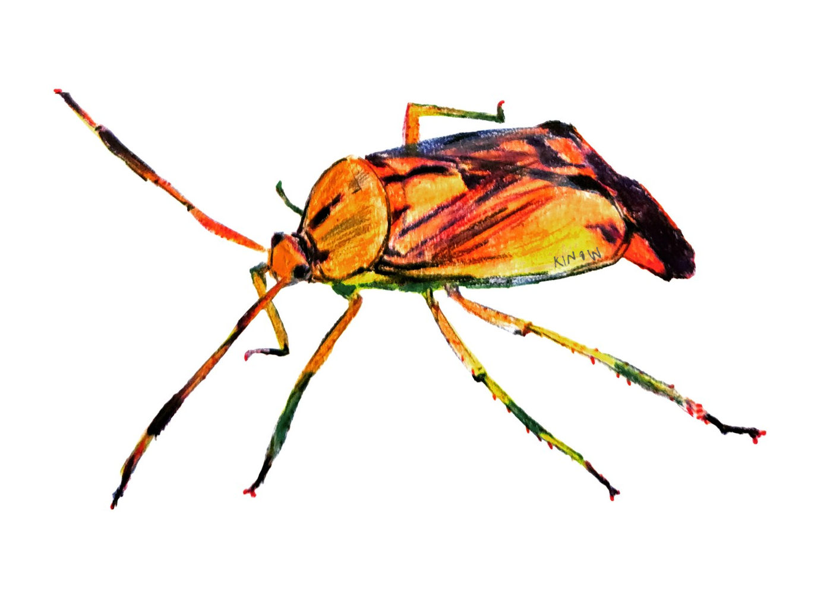

# CWL & MPI

This repository contains CWL-based workflows, execution traces,
conformance test results, and supporting artefacts exploring the integration of the
[Common Workflow Language (CWL)](https://www.commonwl.org/) with the
[Message Passing Interface (MPI)](https://www.mpi-forum.org/).

The workflows were developed as part of the master's thesis:

**“CWL workflows with MPI in bare-metal, containers, cloud, and HPC”**  
by [Bruno de Paula Kinoshita](https://orcid.org/0000-0001-8250-4074), within the Joint Master in High Performance
Computing offered by the [University of Santiago de Compostela](https://www.usc.gal/) and
the [University of A Coruña](https://udc.es/).

The thesis was supervised by [Michael R. Crusoe](https://orcid.org/0000-0002-2961-9670)
and [Prof. Pablo Quesada](https://orcid.org/0000-0002-3790-8819).

  

## Contents

This repository includes:

- CWL workflows integrating MPI execution models
- CWL conformance test results across multiple CWL runners
- Execution logs from HPC and cloud environments
- Supporting scripts for generating thesis figures and LaTeX tables
- A script that generates the RO-Crate file based on the directory contents
- GitHub Actions automation to verify files in this repository

The results cover executions on:

- Hetzner Cloud (OpenMPI 5)
- Framework Laptop AMD 13 (MPICH 4)
- CESGA FinisTerrae III (Intel MPI 2021.3.0)
- CSC LUMI (Cray MPICH 8.1.32)
- BSC MareNostrum 5 (Intel MPI 2021.10.0)

---

## Dataset generation and structure

The directory structure of this repository is fully generated by automated execution
scripts used during the experiments. It reflects the execution hierarchy of CWL conformance
tests & workflows across multiple runners (cwltool, Toil, StreamFlow), MPI implementations,
computing environments, and execution modes.

Output logs were processed to redact personally identifiable information (PII).
No other manual post-processing or restructuring of execution outputs has been
performed. This design choice ensures full traceability and preservation of both
workflow outputs and workflow engine execution behaviour, including internal
runtime state where available.

The dataset therefore includes both:

- execution outputs (workflow results, logs, conformance test outputs)
- execution engine traces (including internal state produced by workflow runners such as Toil and StreamFlow)

This structure is intentional and is required to support analysis of MPI integration
behaviour in CWL execution engines, particularly the `MPIRequirement` extension
evaluated in this thesis.

---

## CWL Conformance Tests

CWL conformance testing was performed using:

- [cwltool 3.2.20260413085819](https://pypi.org/project/cwltool/3.2.20260413085819/)
- [Toil 9.4.1](https://pypi.org/project/toil/9.4.1/)
- [StreamFlow 0.2.0rc2](https://pypi.org/project/streamflow/0.2.0rc2/)

### Test environments

- [CESGA FinisTerrae III](https://cesga-docs.gitlab.io/ft3-user-guide/index.html) 🇪🇸
- [CSC LUMI](https://www.lumi.csc.fi/public/) 🇫🇮
- [BSC MareNostrum 5](https://bsc.es/marenostrum/marenostrum-5) 🇪🇸
- [Hetzner Cloud](https://www.hetzner.com/) 🇩🇪

Reports and results: [CWL Conformance Tests](./cwl-conformance-tests/README.md)

---

## Workflows

The repository contains example workflows used for evaluation
of MPI execution in CWL.

Container-based experiments used images from:
https://hub.docker.com/u/mfisherman, 
https://github.com/mfisherman/docker

---

### Simple MPI Workflow

The `sr.c` program from MPICH is used to validate MPI execution in CWL.
It prints MPI rank information and serves as a minimal correctness test.

Execution variants:

- [cwltool](./workflows/mpich-sr/README-cwltool.md)
- [Toil](./workflows/mpich-sr/README-toil.md)
- [StreamFlow](./workflows/mpich-sr/README-streamflow.md)

Full workflow description: [Simple MPI Workflow](./workflows/mpich-sr/README.md)

---

### FALL3D Workflow

The FALL3D workflow originates from the GEO3BCN-CSIC project:

https://gitlab.geo3bcn.csic.es/fall3d/getit-workflows

This repository includes a modified version that:

- supports execution without container dependencies
- accepts input files and binaries via parameters
- introduces an alternative execution model using `MPIRequirement`

The modified version is available at:
https://github.com/kinow/getit-workflows/pull/1

Full workflow description: [FALL3D Workflow](./workflows/fall3d/README.md)

---

## Supporting scripts

Python scripts in this repository are used to generate LaTeX tables
and figures for the thesis. They process:

- CWL conformance test results
- workflow execution logs
- output artefacts produced during experiments

A `requirements.txt` file is provided where dependencies are required.

---

## Tools and platforms used

The following tools and platforms were used during the thesis:

- CWL
  runners: [cwltool](https://cwltool.readthedocs.io/en/latest/), [Toil](https://toil.readthedocs.io/en/latest/), [StreamFlow](https://streamflow.di.unito.it/)
- MPI implementations: MPICH, OpenMPI, Cray MPICH, Intel MPI
- HPC systems: LUMI, MareNostrum 5, FinisTerrae III
- Development tools: Git, Python, Bash, LaTeX, SSH, FileZilla
- IDE: PyCharm
- Bibliography: Zotero
- Writing: Overleaf
- RO-Crate: rocrate-py, rocrate-validator, Language-Research-Technology/ro-crate-html-js, simleo/rochtml (Docker)

---

## Related repositories

- https://github.com/kinow/msc-project-management/ — thesis planning and research notes
- https://github.com/kinow/getit-workflows/ — fork of FALL3D workflows with MPIRequirement support

---

  
  

---

## License

Data in this repository is licensed under [CC-BY-4.0](https://creativecommons.org/licenses/by/4.0/).

Software components retain their original licences
(e.g., MPICH `sr.c` test program is distributed under the MPICH licence).
